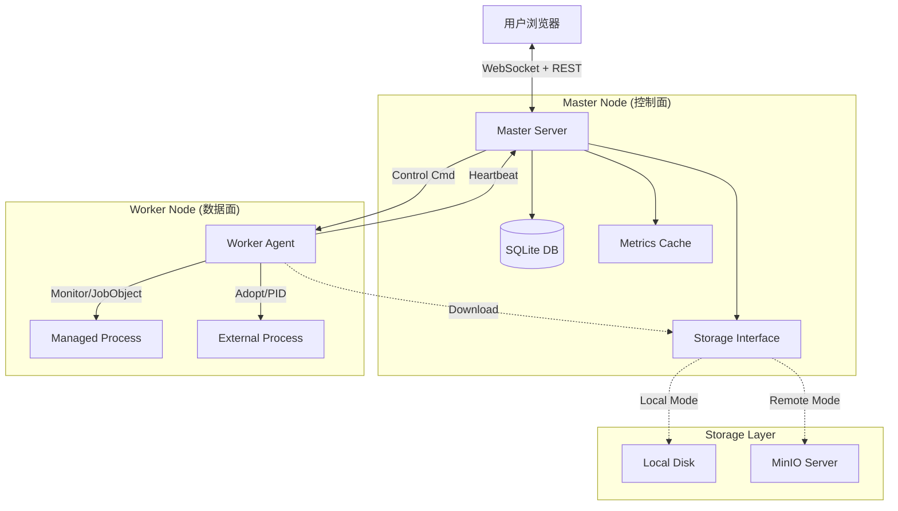

# 🚀 Go Distributed Ops System (GDOS)


**GDOS (Go Distributed Ops System)** 是一个轻量级、跨平台、去中心化的分布式运维管理平台。它采用 Master-Worker 架构，后端基于 Golang，前端基于 Vue3 + Element Plus。

本项目专为中小规模集群设计，无需依赖 Docker/K8s 即可实现**应用部署、进程托管、实时监控、远程终端与审计**。只需一个二进制文件，即可构建私有运维控制台。

---

## ✨ 核心特性

### 🧠 核心架构
*   **单文件交付**：前端资源通过 `go:embed` 编译进 Master 二进制，**零依赖部署**。
*   **混合存储引擎**：
    *   **元数据**：SQLite (Pure Go)，保证数据持久化与一致性。
    *   **实时监控**：内存 RingBuffer，秒级吞吐，保护磁盘 IO。
*   **全双工通信**：基于 **WebSocket** 的状态推送与指令下发，告别低效轮询。
*   **连接池复用**：全局 HTTP Keep-Alive，大幅降低 TCP 握手开销，支持高并发。

### 📦 功能模块
1.  **节点管理 (Node Manager)**
    *   Worker 自动注册与心跳保活。
    *   自动采集硬件指纹（OS、架构、MAC、磁盘）。
    *   支持 **开机自启** (Systemd / Windows Task Scheduler)。
2.  **服务编排 (Service Orchestration)**
    *   **定义与运行分离**：先规划服务组件（Module），再部署实例（Instance）。
    *   **全生命周期**：支持 部署、启动、停止、销毁。
    *   **纳管外部服务**：支持接管非平台部署的遗留进程（Nginx/MySQL/Jar），支持 **PID 文件** 或 **进程名匹配** 策略。
    *   **批量操作**：支持系统级一键全启/全停，后端并发分发指令。
3.  **可观测性 (Observability)**
    *   **实时监控**：秒级展示 CPU、内存、IO 读写速率趋势。
    *   **Web 终端**：基于 xterm.js + PTY 实现的网页版 SSH，支持 vim/top 等交互命令。
    *   **告警中心**：支持自定义阈值、防抖动机制、历史记录查询。
    *   **远程日志**：支持实时 Tail 查看业务日志，支持多文件切换。
4.  **制品管理 (Artifacts)**
    *   支持 **本地文件系统** 或 **MinIO 对象存储**（命令行一键切换）。
    *   Worker 端实现大文件缓存与去重，避免网络风暴。

---

## 🏗️ 系统架构



---

## 📂 项目结构

```text
ops-system/
├── assets.go                # 前端资源 Embed 入口
├── cmd/                     # 入口文件
│   ├── master/              # Master 主程序
│   ├── worker/              # Worker 主程序
│   └── pack-tool/           # 打包工具 CLI
├── internal/                # 内部业务逻辑
│   ├── master/
│   │   ├── api/             # HTTP Handlers (路由与逻辑分发)
│   │   ├── db/              # 数据库初始化
│   │   ├── manager/         # 核心业务 (System, Instance, Log, Package)
│   │   ├── monitor/         # 内存时序存储
│   │   └── ws/              # WebSocket 广播中心
│   └── worker/
│       ├── agent/           # 心跳与注册
│       ├── executor/        # 执行器 (部署、进程管理、监控、PTY终端)
│       ├── handler/         # Worker HTTP Server
│       └── utils/           # Worker 工具 (自启等)
├── pkg/                     # 公共包
│   ├── protocol/            # 通讯协议结构体
│   ├── storage/             # 存储抽象层 (Local/MinIO)
│   ├── packer/              # 打包逻辑核心库
│   └── utils/               # HTTP Client 封装
└── web/                     # Vue3 前端源码
```

---

## 🚀 环境与构建

### 1. 环境准备
*   **Go**: 1.21+
*   **Node.js**: 16+ (仅构建前端需要)
*   **GCC**: 不需要 (使用 pure-go SQLite 驱动)

### 2. 编译指南

#### 第一步：构建前端
```bash
cd web
npm install
npm run build
# 产物将生成在 web/dist，供 Master 嵌入
cd ..
```

#### 第二步：构建后端
```bash
go mod tidy

# 1. 编译 Master
go build -o master ./cmd/master/main.go
# (Windows) go build -o master.exe ./cmd/master/main.go

# 2. 编译 Worker
go build -o worker ./cmd/worker/main.go

# 3. 编译打包工具
go build -o pack-tool ./cmd/pack-tool/main.go
```

---

## 💻 运行与部署

### Master (控制节点)
Master 默认监听 `:8080`，数据存储在当前目录。

```bash
# 默认启动 (本地存储)
./master

# 生产环境启动 (修改端口、使用 MinIO、指定 DB 路径)
./master -port :9090 \
         -db_path /data/ops.db \
         -store_type minio \
         -minio_endpoint 192.168.1.100:9000 \
         -minio_ak admin -minio_sk password
```

### Worker (被控节点)
Worker 默认监听 `:8081`，启动后自动连接 Master。

```bash
# 默认启动
./worker

# 指定 Master 地址
./worker -port 8082 -master http://192.168.1.100:9090

# 设置开机自启 (需要管理员/Root权限)
# 注意：自启命令会将当前参数写入系统服务文件
sudo ./worker -master http://1.2.3.4:9090 -autostart 1
```

---

## 📦 服务包管理与规范

为了规范化管理，系统提供了 `pack-tool` 工具，且强制要求 ZIP 包包含 `service.json`。

### 1. 打包工具使用
```bash
# 初始化目录 (生成 service.json 模板)
./pack-tool init ./my-project

# 打包 (校验并生成 zip)
./pack-tool build ./my-project -o my-app-v1.zip
```

### 2. `service.json` 规范详解
这是 Worker 管理进程的核心依据。

```json
{
  "name": "payment-service",      // 服务名称
  "version": "1.0.2",             // 版本号
  "os": "linux",                  // 适用系统 (windows/linux)
  
  // --- 启动配置 ---
  // 相对路径。Windows下自动补全.exe，Linux下自动赋予+x权限
  "entrypoint": "bin/app_linux",
  "args": ["-c", "../conf/config.yaml"],
  "env": {
    "GIN_MODE": "release"
  },

  // --- 停止配置 (可选) ---
  // 默认为 Kill PID。Java/Tomcat 等复杂应用建议配置脚本。
  "stop_entrypoint": "bin/stop.sh",

  // --- 纳管配置 (仅用于外部服务接管) ---
  "is_external": false,          // 是否为纳管服务
  "pid_strategy": "spawn",       // "spawn"(默认): 父子进程; "match": 匹配进程名
  "process_name": "java.exe",    // 仅 match 策略需要

  // --- 日志配置 (可选) ---
  // 用于前端下拉查看不同的日志文件
  "log_paths": {
      "Access Log": "logs/access.log",
      "Error Log": "/var/log/app/error.log"
  }
}
```

---

## 🛠️ 命令行参数参考

### Master Flags
| 参数 | 默认值 | 描述 |
| :--- | :--- | :--- |
| `-port` | `:8080` | HTTP 服务监听地址 |
| `-upload_dir` | `./uploads` | 本地存储模式下的文件路径 |
| `-db_path` | `./ops_data.db` | SQLite 数据库路径 |
| `-store_type` | `local` | 存储后端: `local` 或 `minio` |
| `-config` | `` | 指定 config.yaml 配置文件路径 |
| `-minio_xxx` | ... | MinIO 相关配置 (endpoint, ak, sk, bucket) |

### Worker Flags
| 参数 | 默认值 | 描述 |
| :--- | :--- | :--- |
| `-port` | `8081` | Worker HTTP 监听端口 (用于 Master 回调) |
| `-master` | `http://127.0.0.1:8080` | Master 地址 |
| `-work_dir` | `./instances` | 实例运行目录 |
| `-autostart` | `-1` | 自启设置: `1`=开启, `0`=关闭, `-1`=忽略 |
| `-secret` | `...` | 鉴权密钥 (需与 Master 一致) |
