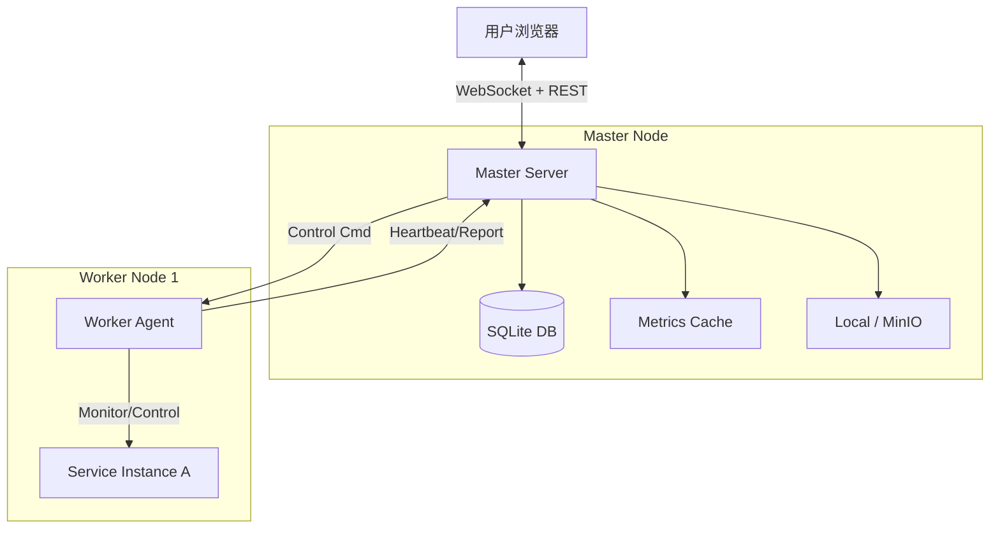

# 🚀 Go Distributed Ops System (GDOS)


**Go Distributed Ops System** 是一个轻量级、跨平台、去中心化的分布式运维管理系统。它采用 Master-Worker 架构，后端基于 Golang，前端基于 Vue3 + Element Plus。

本项目旨在为中小规模集群提供开箱即用的应用部署、进程管理、实时监控与审计能力。无需依赖 Docker 或 K8s，**只需一个二进制文件，即可管理你的服务集群**。

---

## ✨ 核心特性

### 🧠 核心架构
- **单文件交付**：前端资源通过 `go:embed` 打包进 Master 二进制，无需 Nginx，部署极其简单。
- **混合存储**：元数据存储于 **SQLite** (Pure Go, 无 CGO)，实时监控数据存储于 **内存**，兼顾持久化与高性能。
- **实时通信**：基于 **WebSocket** 的状态推送机制，告别低效轮询，状态变更毫秒级触达前端。
- **连接复用**：全局 HTTP Keep-Alive 连接池，大幅降低 TCP 握手开销，支持高并发指令下发。

### 📦 功能模块
1.  **节点管理 (Node)**
    - Worker 自动注册与心跳保活。
    - 自动采集主机静态信息（OS、CPU架构、MAC）与动态负载。
    - 支持开机自启（Systemd / Windows Task Scheduler）。
2.  **服务包管理 (Package)**
    - 支持大文件断点/流式上传，自动解析 `.zip` 包内的 `service.json` 元数据。
    - **存储后端**：支持 **本地文件系统** 或 **MinIO 对象存储**（命令行一键切换）。
3.  **业务系统编排 (System)**
    - **定义与运行分离**：先规划业务系统包含哪些服务组件（Module），再将其部署到具体节点（Instance）。
    - **纳管外部服务**：支持接管非平台部署的“野生”进程（如 Nginx、MySQL 或遗留应用），支持 PID 文件、进程名匹配等多种接管策略。
    - **全生命周期管理**：部署 (Deploy)、启动 (Start)、停止 (Stop)、销毁 (Destroy)。
    - **批量操作**：支持系统级的一键全量启动/停止，后端并发分发指令。
4.  **实时监控 (Monitor)**
    - **进程级监控**：Worker 内置监控协程，实时采集业务进程的 CPU、内存 (RSS)、IO 读写速率。
    - **告警中心**：支持自定义阈值告警（CPU/内存/状态），支持防抖动机制，记录告警历史。
5.  **审计与灾备**
    - **操作日志**：记录所有关键操作流水。
    - **数据备份**：支持 SQLite 在线热备（Snapshot），支持全量恢复。

---

## 🏗️ 系统架构



---

## 🚀 快速开始

### 1. 环境准备
- **Go**: 1.21 或更高版本
- **Node.js**: 16+ (仅构建前端需要)

### 2. 编译构建

#### 1. 构建前端
```bash
cd web
npm install
npm run build
# 产物生成在 web/dist 目录，供后端 embed 使用
cd ..
```

#### 2. 构建后端
```bash
# 整理依赖
go mod tidy

# 编译 Master (Linux/Mac)
go build -o master ./cmd/master/main.go
# 编译 Worker (Linux/Mac)
go build -o worker ./cmd/worker/main.go

# Windows 环境请添加 .exe 后缀
# go build -o master.exe ./cmd/master/main.go
# go build -o worker.exe ./cmd/worker/main.go
```

### 3. 启动运行

#### 启动 Master
Master 默认监听 8080 端口，数据存储在当前目录。
```bash
# 默认启动
./master

# 自定义参数启动 (修改端口、存储MinIO)
./master -port :9090 \
         -store_type minio \
         -minio_endpoint 192.168.1.100:9000 \
         -minio_bucket ops-repo
```
访问浏览器：`http://localhost:8080`

#### 启动 Worker
Worker 默认监听 8081 端口，连接本地 Master。
```bash
# 默认启动
./worker

# 指定 Master 地址
./worker -port 8082 -master http://192.168.1.100:8080

# 设置开机自启 (需要管理员权限)
sudo ./worker -master http://1.2.3.4:8080 -autostart 1
```

---

## ⚙️ 命令行参数说明

### Master
| 参数 | 默认值 | 说明 |
| :--- | :--- | :--- |
| `-port` | `:8080` | Master 服务监听端口 |
| `-upload_dir` | `./uploads` | 本地模式下的文件存储目录 |
| `-db_path` | `./ops_data.db` | SQLite 数据库文件路径 |
| `-store_type` | `local` | 存储类型: `local` 或 `minio` |
| `-minio_endpoint` | `127.0.0.1:9000` | MinIO 地址 |
| `-minio_ak` | `minioadmin` | MinIO Access Key |
| `-minio_sk` | `minioadmin` | MinIO Secret Key |
| `-minio_bucket` | `ops-packages` | MinIO 桶名称 |

### Worker
| 参数 | 默认值 | 说明 |
| :--- | :--- | :--- |
| `-port` | `8081` | Worker 服务监听端口 (用于 Master 回调) |
| `-master` | `http://127.0.0.1:8080` | Master 的 HTTP 地址 |
| `-work_dir` | `./instances` | 实例部署与运行的工作目录 |
| `-autostart` | `-1` | 设置开机自启: `1`=开启, `0`=关闭, `-1`=忽略 |

---

## 📝 服务包规范 (`service.json`)

为了让系统正确管理应用，ZIP 包根目录必须包含 `service.json`。

**文件结构示例：**
```text
my-app-v1.zip
├── service.json      <-- 核心描述文件
├── bin/
│   └── app_linux     <-- 可执行文件
└── conf/
    └── config.yaml
```

**`service.json` 字段详解：**

```json
{
  "name": "payment-service",      // 服务名称
  "version": "1.0.2",             // 版本号
  "description": "支付核心服务",    // 描述
  "os": "linux",                  // 适用系统 (windows/linux/darwin)
  
  // --- 启动配置 ---
  // 相对路径。Windows下会自动补全.exe，Linux下会自动赋予+x权限
  "entrypoint": "bin/app_linux",
  
  // 启动参数 (数组)
  "args": ["-c", "../conf/config.yaml", "--port", "8888"],
  
  // 环境变量注入 (可选)
  "env": {
    "GIN_MODE": "release",
    "DB_HOST": "10.0.0.5"
  },

  // --- 停止配置 (可选) ---
  // 如果不填，默认使用 Kill PID 方式停止。
  "stop_entrypoint": "bin/stop.sh",
  "stop_args": ["-f"],

  // --- 日志配置 (可选) ---
  // 用于前端下拉查看不同的日志文件
  "log_paths": {
      "Access Log": "logs/access.log",
      "Error Log": "/var/log/app/error.log"
  },
  
  // --- 纳管/进程识别策略 (高级) ---
  // "spawn": 默认，父进程即子进程
  // "match": 启动脚本执行完即退出，需通过进程名查找真实进程
  "pid_strategy": "spawn",
  "process_name": "java.exe" // 仅 match 策略需要
}
```

---

## 📂 项目结构

```text
ops-system/
├── assets.go                # 前端资源 Embed 入口
├── cmd/
│   ├── master/              # Master 入口 (参数解析)
│   ├── worker/              # Worker 入口 (参数解析)
│   └── test-tool/           # 压测与模拟工具
├── internal/
│   ├── master/
│   │   ├── api/             # HTTP Handlers (路由与逻辑分发)
│   │   ├── db/              # 数据库初始化
│   │   ├── manager/         # 核心业务 (System, Instance, Log, Package, Alert)
│   │   ├── store/           # (Deprecated) 旧内存存储
│   │   └── ws/              # WebSocket Hub (广播中心)
│   └── worker/
│       ├── agent/           # 心跳与注册
│       ├── executor/        # 执行器 (部署、进程管理、监控采集、纳管)
│       ├── handler/         # Worker HTTP Server
│       └── utils/           # Worker 通用工具 (自启、HTTPClient)
├── pkg/
│   ├── protocol/            # 通讯协议结构体
│   ├── storage/             # 存储抽象层 (Local/MinIO)
│   └── utils/               # 公共工具
└── web/                     # Vue3 前端源码
```

---

## 🛠️ 后续演进 (Roadmap)

- [ ] **安全鉴权**：增加 Master/Worker 通信的 Token 认证，API 接口增加登录拦截。
- [ ] **日志管理**：引入日志轮转 (Log Rotation) 防止磁盘写满。
- [ ] **依赖编排**：支持定义服务启动顺序（Level 1 -> Level 2）。
- [ ] **高可用**：支持 Master 集群模式。

---

## 📄 License

[MIT License](LICENSE)